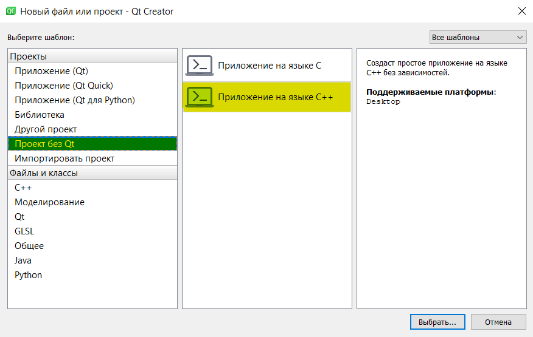
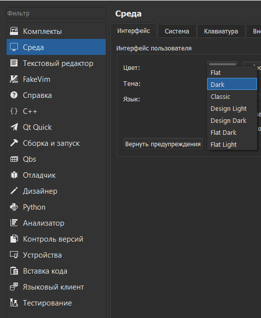
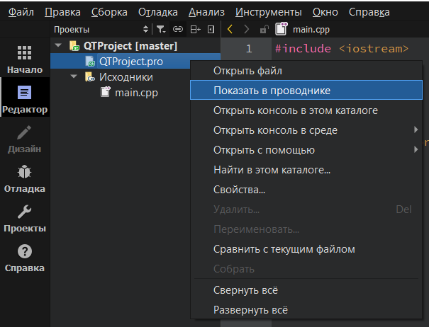
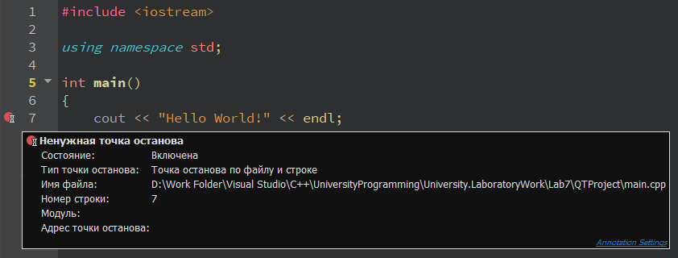
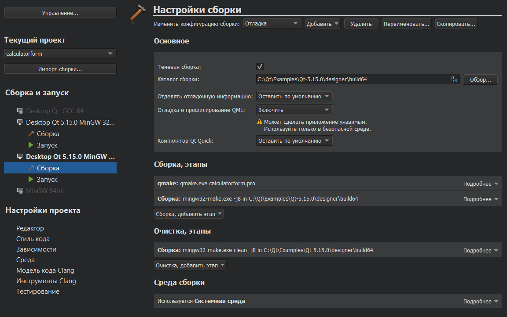
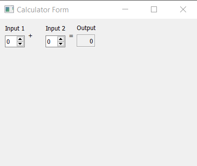
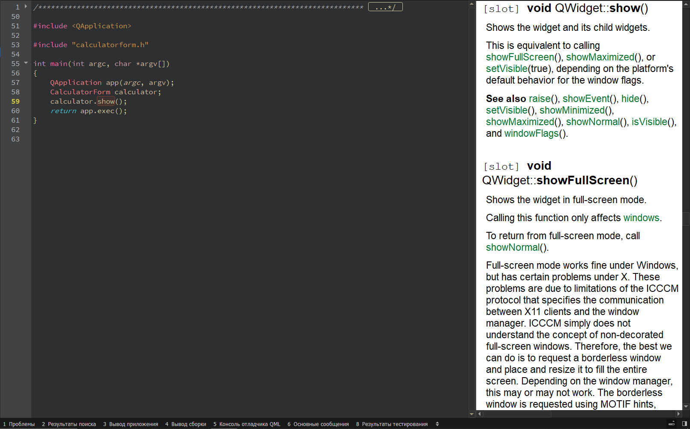
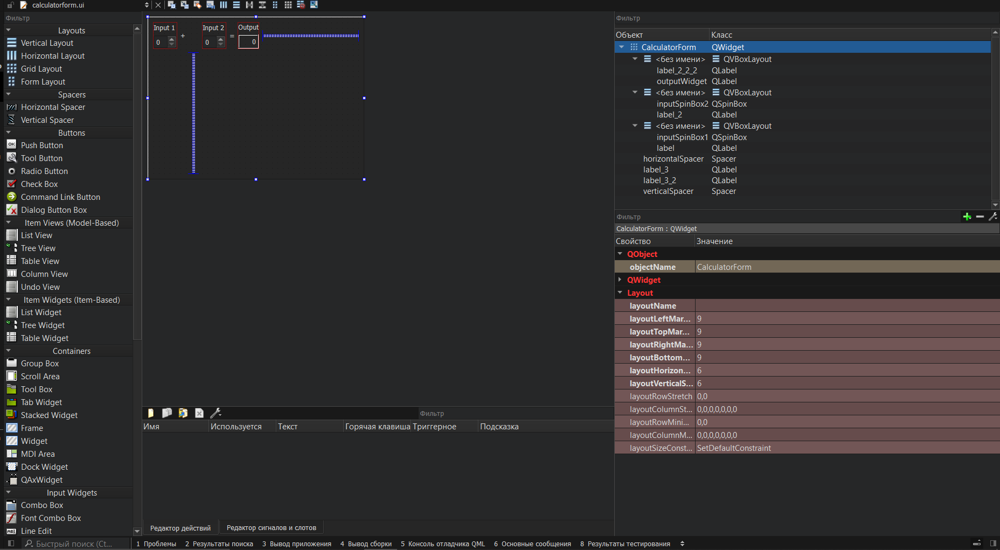
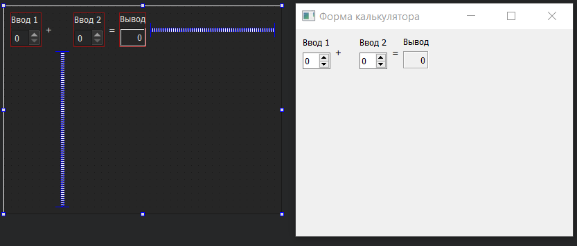

МИНИСТЕРСТВО НАУКИ  И ВЫСШЕГО ОБРАЗОВАНИЯ РОССИЙСКОЙ ФЕДЕРАЦИИ  
Федеральное государственное автономное образовательное учреждение высшего образования  
"КРЫМСКИЙ ФЕДЕРАЛЬНЫЙ УНИВЕРСИТЕТ им. В. И. ВЕРНАДСКОГО"  
ФИЗИКО-ТЕХНИЧЕСКИЙ ИНСТИТУТ  
Кафедра компьютерной инженерии и моделирования
  

​

### Отчёт по лабораторной работе № 7  по дисциплине "Программирование"

 
​
студента 1 курса группы ИВТ-192(1)  
Москаленко Алексея Константиновича
направления подготовки 09.03.01 "Информатика и Вычислительная Техника"  
 
​
<table>
<tr><td>Научный руководитель  старший преподаватель кафедры  компьютерной инженерии и моделирования</td>
<td>(оценка)</td>
<td>Чабанов В.В.</td>
</tr>
</table>
  

Симферополь, 2019

------

# Лабораторная работа №7 Изучение базовых возможностей IDE Qt Creator

## Цель

- Изучить основные возможности создания и отладки программ в IDE Qt Creator.

## Ход выполнения

### Задание 1

Для создания приложения без использования фреймворка Qt необходимо зайти в меню `Файл => Создать файл или проект`. 

*Рис. 1. Создание приложения.*

### Задание 2

Для изменения цветовой схемы необходимо зайти в меню `Инструменты => Параметры => Среда`. 

*Рис. 2. Измнение цветовой схемы.*

### Задание 3

Комментирование выделенного блока кода осуществляется нажатием сочетания клавиш `Ctrl + /`

### Задание 4

Открыть в проводнике папку, содержающую проект или любой другой файл можно правым щелчком мыши и выбором соответсвующего пункта меню.

*Рис. 3. Открытие папки в проводнике.*

### Задание 5

Qt Creator для хранения информации о проекте использует файлы расширения `.pro`

### Задание 6

Для запуска проекта используется сочетание клавиш Ctrl + R. 
Либо кнопкой интерфейса среды разработки, выделенной розовым цветом на рисунке 4. 

*Рис. 4. Открытие папки в проводнике.*

### Задание 7

Для запуска проекта в режиме отладки выполняется кнопкой интерфейса среды разработки, выделенной розовым цветом на рисунке 5. 

*Рис. 5. Запуск без отладки.*

### Задание 8

Установка точки останова добавляется путём клика на место соответствующей строки на правой панели, рядом с номерами строк, либо горячей клавишей `F9`. 

*Рис. 6. Установленная точка останова.*

### Задание 9

#### Значение i в 5 строке
`5`
#### Значение d в 6 строке
`8.518854e-317`
#### Значение i & d в 7 строке
`i: 5; d: 5` 
#### Совпадают ли значения
Значения с Microsoft Visual Studio отличаются.

### Задание 11-14
После поиска и открытия проекта **Calculator Form Example** был настроен комплект MinGW64 с компилятором GCC. 

*Рис. 7. Настройки комплекта.*

Запущенное приложение продемонстрировано на рисунке 8. 

*Рис. 8. Окно приложения.*

### Задание 15
Справка по функциям Qt(show) выглядит таким образом. 

*Рис. 9. Справка Qt.*

### Задание 16
Окно редактирования формы в Qt выглядит так, как изображено на рисунке 10. 

*Рис. 10. Редактирование формы Qt.*

### Задание 17
Редактирование заголовков для полей ввода можно менять кликнув на соответствующий тайтл левой кнопкой мыши. 
Редактирование заголовка окна приложения находится во вкладе `QWidget => windowTitle` 

*Рис. 11. Измененная форма приложения*

## Вывод

В ходе проделанной работы были получены следующие знания:
- Создание проектов в среде разработки Qt Creator
- Комментирование блоков кода
- Создание точек останова
- Создание оконнных приложений
- Редактирование форм
- Получение справки о функциях Qt