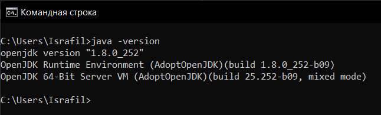
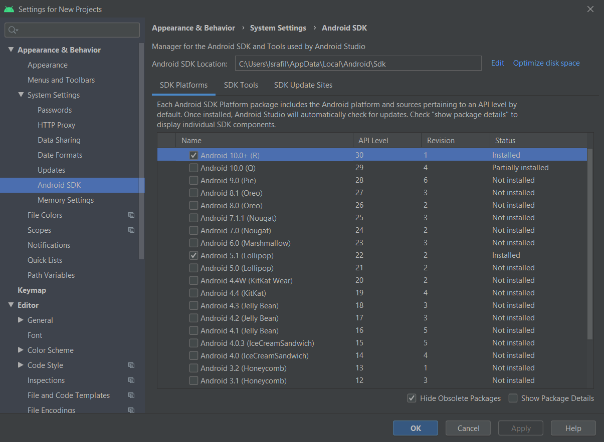

МИНИСТЕРСТВО НАУКИ  И ВЫСШЕГО ОБРАЗОВАНИЯ РОССИЙСКОЙ ФЕДЕРАЦИИ  
Федеральное государственное автономное образовательное учреждение высшего образования  
"КРЫМСКИЙ ФЕДЕРАЛЬНЫЙ УНИВЕРСИТЕТ им. В. И. ВЕРНАДСКОГО"  
ФИЗИКО-ТЕХНИЧЕСКИЙ ИНСТИТУТ  
Кафедра компьютерной инженерии и моделирования
  

​

### Отчёт по лабораторной работе № 8  по дисциплине "Программирование"

 
​
студента 1 курса группы ИВТ-192(1)  
Москаленко Алексея Константиновича
направления подготовки 09.03.01 "Информатика и Вычислительная Техника"  
 
​
<table>
<tr><td>Научный руководитель  старший преподаватель кафедры  компьютерной инженерии и моделирования</td>
<td>(оценка)</td>
<td>Чабанов В.В.</td>
</tr>
</table>
  

Симферополь, 2019

------

# Настройка Qt Creator для разработки приложений под android

## Цель
- Настроить IDE Qt Creator для разработки приложений под android ОС;
- Изучить базовые понятия связанные с мобильной разработкой;
- Научиться создавать мобильные приложения при помощи фреймворка Qt 5.14.

## Инструменты
- IDE Qt Creator с набором предварительно собранных компонент фреймворка Qt 5.14 для android
- OpenJDK 8
- Android Studio
- Компоненты для сборки приложений

## Ход работы

### Установка пакета разработки Android
При помощи инструмента обновления и установки пакетов Qt `MaintainceTool` 
В соответствующем меню был установлен пакет "Android" для соответствующей версии Qt Creator. 

*Рис. 1. Окно установки пакета*

### Установка Java Development Kit
По причине долгой регистрации на оффициальном сайте Java, был выбран пакет AdoptJDK, загруженный по ссылке из методических рекомендаций к лабораторной работе. 
После установки в интерпретаторе командной строки была запущена команда для проверки правильности установки комплекта. 

*Рис. 2. Проверка установки JDK*

### Установка Andriod Studio
В связи с местонахождением не на территории Крыма на момент написания лабораторной работы, подключение VPN не является необходимостью для загрузки данного приложения. 
После установки, внутри меню настроек были установлены все необходимые комплекты. 

*Рис. 3. Установка паектов в Android Studio*

### Настройка Qt Creator

После установки всех необходимых инструментов, была настройка среда разработки Qt. 
В соответствующем пункте меню Qt был указан путь к SDK и установлены все оставшиеся настройки. 

*Рис. 4. Настройка Qt Creator*

### Сборка проекта

Для примера проекта был выбран шаблон `Analog Clock Window Example`. 
Установка драйвера была осуществлена в Android Studio( Google USB Driver). 
При помощи USB-кабеля после сборки приложение было запущено на смартфоне. 

*Рис. 5. Рабочий стол телефона после сборки приложения*

## Вывод

В ходе проделанной работы были получены следующие навыки:
- Настройка Qt Creator для создания приложений Android
- Загрузка и настройка пакетов для разрабокти
- Отладка приложений на смартфоне через USB подключение