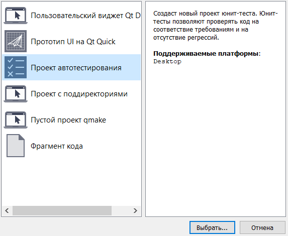
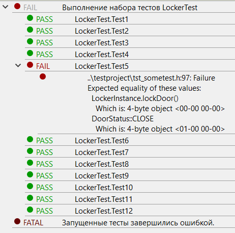

МИНИСТЕРСТВО НАУКИ  И ВЫСШЕГО ОБРАЗОВАНИЯ РОССИЙСКОЙ ФЕДЕРАЦИИ  
Федеральное государственное автономное образовательное учреждение высшего образования  
"КРЫМСКИЙ ФЕДЕРАЛЬНЫЙ УНИВЕРСИТЕТ им. В. И. ВЕРНАДСКОГО"  
ФИЗИКО-ТЕХНИЧЕСКИЙ ИНСТИТУТ  
Кафедра компьютерной инженерии и моделирования
<br/><br/>

​

### Отчёт по лабораторной работе № 9<br/> по дисциплине "Программирование"

<br/>
​
студента 1 курса группы ИВТ-192(1)  
Москаленко Алексея Константиновича
направления подготовки 09.03.01 "Информатика и Вычислительная Техника"  
<br/>
​
<table>
<tr><td>Научный руководитель<br/> старший преподаватель кафедры<br/> компьютерной инженерии и моделирования</td>
<td>(оценка)</td>
<td>Чабанов В.В.</td>
</tr>
</table>
<br/><br/>

Симферополь, 2019

------

# Тестирование при помощи Google Test Framework

## Введение
 
Для тестирования любого проекта необходимы соответствующие инструменты.<br>
Зачастую в библиотеках дифферентной сложности, что вы можете найти в открытых источниках, встречается пункт тестирования при сборке из исходников.<br>
Почти всегда инструментом для проведения тестов является фреймворк Googletest, включащий себя фреймворк для работы с **`моками`**.<br>
Особенностью любого "хорошо" написанного кода является некий необходимый уровень абстракции, позволяющий отделить реализацию от объявления.<br>
Создание интерфейсов или базовых классов - один из признаков гибкого когда, исключающего монолитность.<br>
Создание абстракций и работа с сущностями на основании общего интерфейса является основным пунктом широко используемой парадигмы полиморфизма подтипов.<br>
Полиморфизм позволяет использовать одну из самых необходимых и часто используемых операций - апкаст и даункаст.<br>
Поскольку полиморфизм является неотъемлемой парадигмой объектно-оринетированного программирования и проект, указанный для проведения тестов использует ООП, то разговор о полиморфизме будет проводиться в рамках конструкций ООП - классов.
Апкаст приводит производный класс к базовому и позволяет 'общаться' с конкретными объктами, как с абстрактными.<br>
Это значит, что в объекте-наследнике вы определяете работу конкретного метода, создаёте реализацию, а в другой части когда используется лишь общий интерфейс метода.<br>
Таким образом, функция, использующая ваш объект-наследник, не знает как работает конкретная реализация в производном классе, но ожидается определенное поведение.<br>
Допустим, если существует несколько типов подключения к серверу, необходимо реализовать работу подключения для каждого из типов, а когда будет необходимо вызывать одну общую функцию, как бы точку входа.<br>
Если унаследоваться от одного интерфейса каждому типу подключения, то функция, использующая подключение вызовет один метод, определенный в интерфейсе и получит небходимые данные вне зависимости от того, как будет работать это подключение.<br>
<br>
В примере проекта любые реализации кейпадов и защёлок никак не влияют на конечную работа класса lockcontroller, поскольку задекларированы два интерфейса **IKeypay** и **ILatch**.<br>
А это значит, что мы можем создать собственные реализации защёлок и клавиатур.<br>
Чтобы не проводить лишнюю работу по написанию кода, существуют **`моки`**.
Данные конструкции выполняют роль эмуляции поведения определеного метода.<br>
При помощи моков можно легко описать опредленное поведение функции, эмулировать ее выполнение и вернуть конкретное значение.<br>
<br>
В данной лабораторной работе также используются моки для эмуляции вызова функции определенного интерфейса.<br>
Для этого были определены классы:
- **`MockInheritorIKeypad`**
- **`MockInheritorILatch`**

## Цель

- Познакомиться с Google Test и Google Mock Framework;
- Изучить базовые понятия относящийся к тестированию кода;
- Научиться тестировать классы в среде разработки Qt Creator.

## Используемые инструменты

- Qt Creator 5.14
- Google Testing and Mocking Framework

## Ход работы

### Подготовка инструментов

Для начала работы необходимо загрузить фреймворк для тестирования из [оффициального репозитория Googletest](https://github.com/google/googletest.git).<br>
Распакуем корневую директорию в общую папку проекта.<br>
Также скачаем [проект](https://neroid.ru/wp-content/uploads/2020/05/Lab9_Project_for_tests.zip) и распакуем в ту же общую папку.<br>
И далее создаём проект автотестирования в Qt.<br>


*Рис. 1. Проект автотестирования в Qt Creator IDE*

### Выполнение работы

**Полный исходный** код доступен по данной [ссылке](QTProject/Testing/tst_testsuit.h)

Как было указано ранее, для выполнения тестирования необходимо создать два мока, наследующих соответствующих интерфейса.

```cpp
class MockInheritorIKeypad : public IKeypad{
public:
    MOCK_METHOD( bool, isActive, (), (override) );
    MOCK_METHOD( void, wait, (), (override) );
    MOCK_METHOD( PasswordResponse, requestPassword, (), (override) );
};

class MockInheritorILatch : public ILatch{
public:
    MOCK_METHOD( bool, isActive, (), (override) );
    MOCK_METHOD( DoorStatus, open, (), (override) );
    MOCK_METHOD( DoorStatus, close, (), (override) );
    MOCK_METHOD( DoorStatus, getDoorStatus, (), (override) );
};
```

Последующие тесты реализованы с объявлением данных классов и также передаются внутрь инстанса LockContoller'а.

Например:
```cpp
TEST(LockerTest, Test1){
    MockInheritorIKeypad Keypad;    // Здесь
    MockInheritorILatch Latch;      // И здесь

    LockController LockerInstance(&Keypad, &Latch);

    EXPECT_CALL(Keypad, wait())
            .Times(1);

    LockerInstance.wait();
}
```

## Результаты тестировани

Все написанные тесты прошли проверку, помимо теста под номером **`5`**, о чём свидетльствует скриншот представленные ниже.<br><br>


*Рис 2. Результаты тестирования*

### Ошибка

Данная ошибка вызвана в результате выполнения метода **`LockController::lockDoor()`**.

Исходный код метода:
```cpp
DoorStatus LockController::lockDoor()
{
    return latch->open();
}
```
### Причины
Причиной данной ошибки является выполнение неверного метода объекта latch.<br>
Судя по названию метода `lockDoor`, данный блок кода реализует закрытие защёлки, однако в исходном коде вызывается метод, открывающий защёлку двери.<br>
В результаты выполнения метода `lockDoor` будет вызван метод из инстанса latch проивзодного класса от интерфейса ILatch, который, по спецификации, всегда возвращает значение `DoorStatus::OPEN`.<br>

### Исправление ошибки

Для исправления ошибки, выявленной тестом необходимо в файле реализации LockController'а изменить метод, вызываемый из ILatch.

Из `return latch-open();` в `return latch->close();`


#### Конечная реализация метода lockDoor

```cpp
DoorStatus LockController::lockDoor()
{
    return latch->close();
}
```


## Вывод

В ходе проделанной работы были получены следующие знания:
- Работа с Google Test Framework
- Выражения на проверку истинности выражений при помощи конструкций `EXPECT` и `ASSERT`.
- Создание и работа с моками фреймворка.